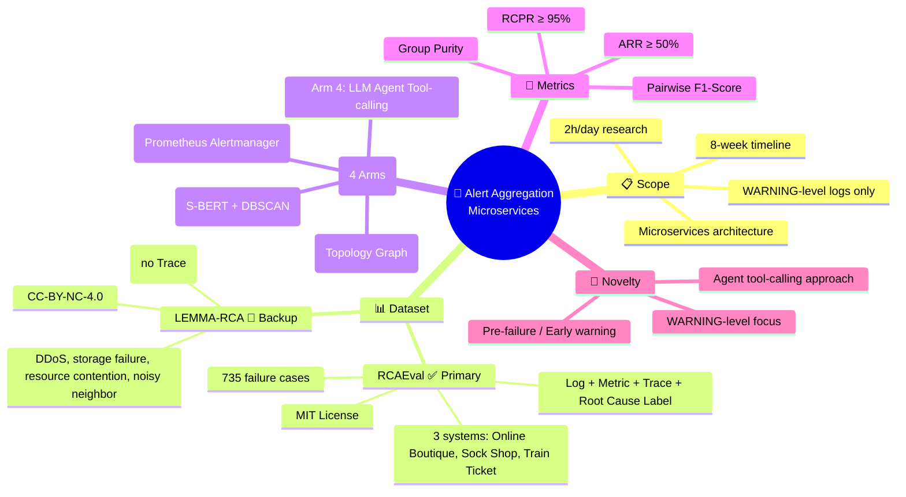
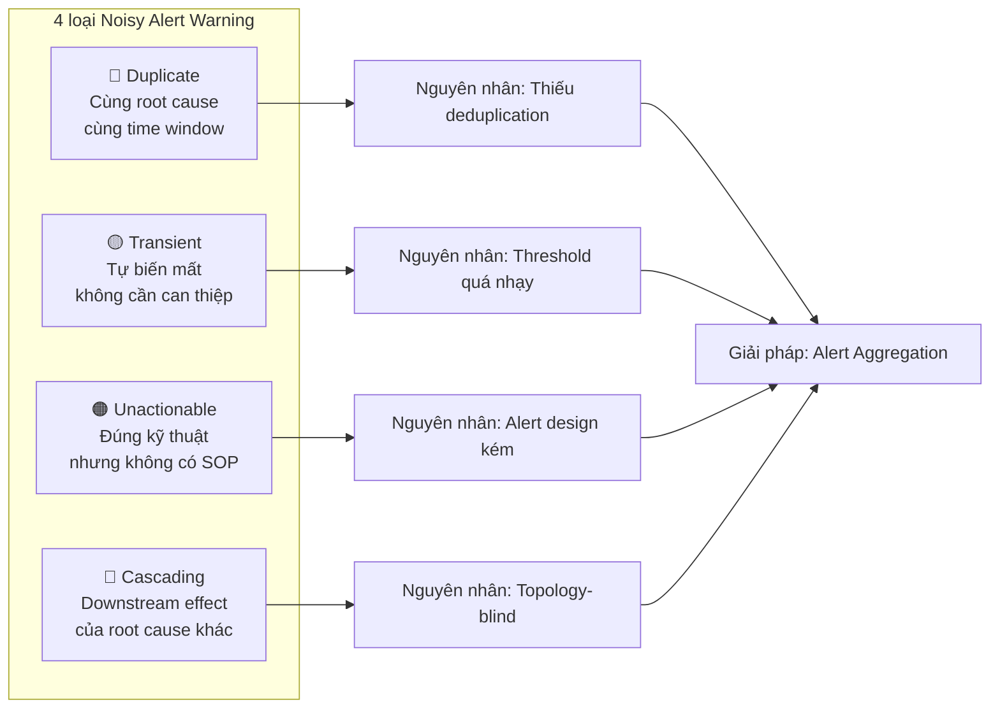
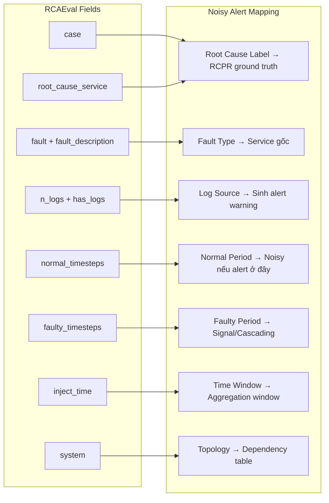
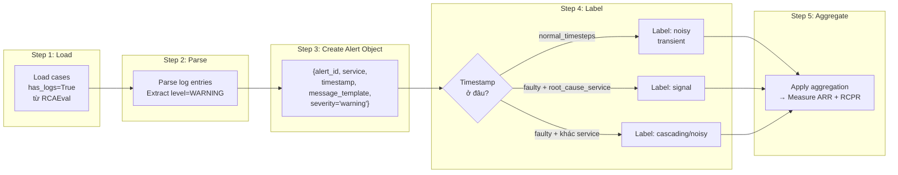
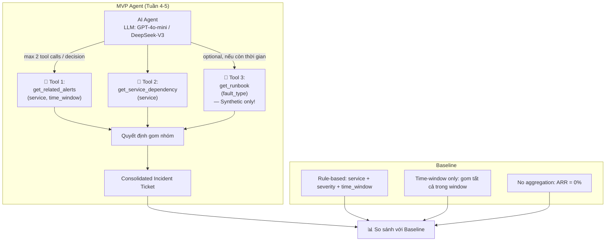
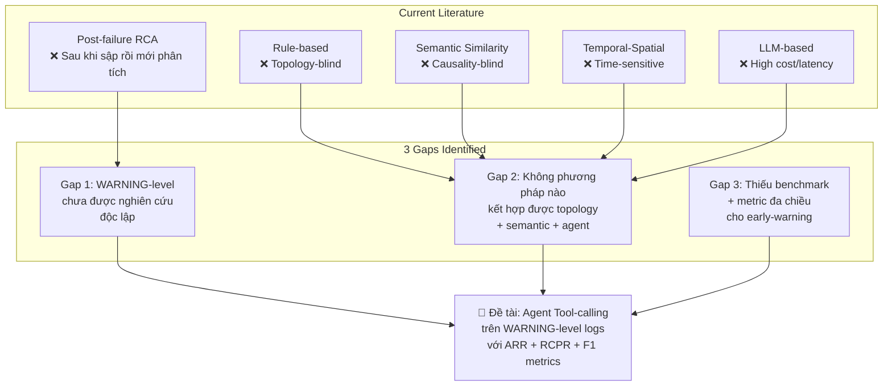
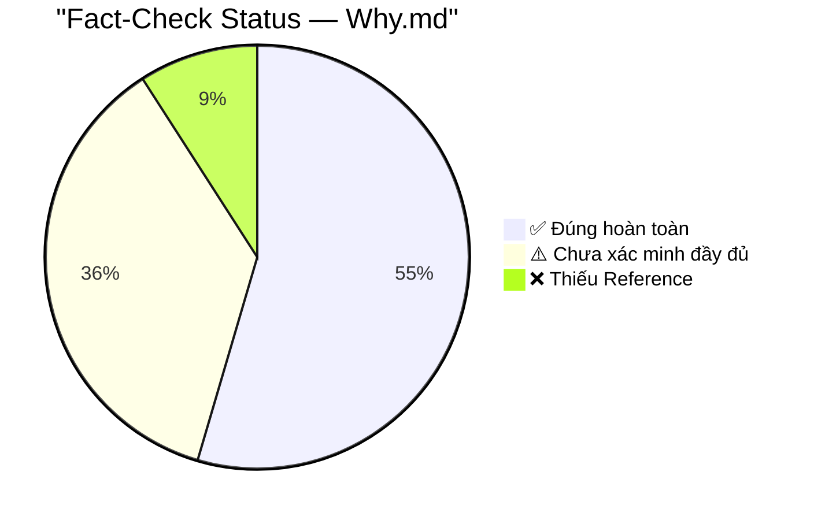
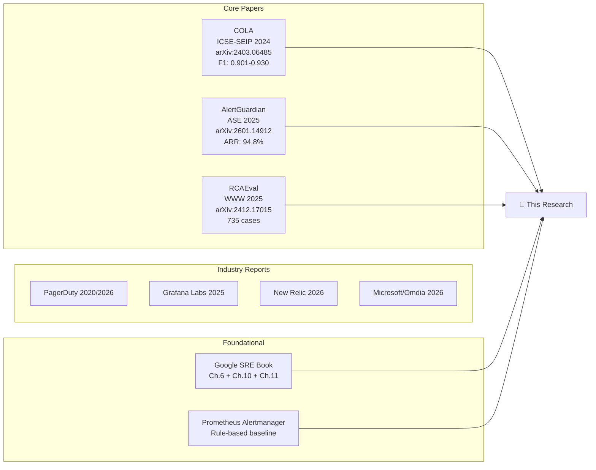

# 🧠 PROJECT MINDMAP — Alert Aggregation in Microservices

> ⚠️ **CẢNH BÁO TÍNH MỚI (cập nhật 2026-09-28)**: mindmap này được tạo **trước khi kiểm chứng dữ liệu RCAEval**, nên một số số liệu đã **lỗi thời**. Các điểm cần bỏ qua:
> - "735 failure cases" → thực tế chỉ **359 case có log** (suite RE1 gồm 375 case là metric-only).
> - "WARNING-level logs only" → RCAEval **không có cột `severity`**; mức phải **tự gán** theo quy trình 3 tầng.
> - "Log + Metric + Trace" cho mọi case → chỉ **240 case có trace**, **8 case có `root_cause.txt`**.
> - "ARR ≥ 50%" ở phần Metrics và "≥ 60%" ở phần TÓM TẮT → **mâu thuẫn**; giá trị đã chốt là **≥ 60%**.
> - "Group Purity" cho RCPR → RCPR nay có **định nghĩa kép** (mức service và mức alert).
>
> **Nguồn đúng cần dùng**: `cp1/data_schema_notes.md` (số liệu kiểm chứng), `cp1/CP1_Ban_Dinh_Huong.md` (định hướng đã sửa), `cp2/CP2_Gap_Analysis.md` (gap analysis).

> Auto-generated from project analysis

---

## 1. HIGH-LEVEL OVERVIEW (Sơ đồ tổng thể)

---

## 2. PROJECT FLOW & CHECKPOINTS

```mermaid
graph TD
    subgraph "Tuần 1 — CP1"
        A1[Chốt dataset] --> A2[Định nghĩa Noisy Alert Warning]
        A2 --> A3[Research Question + Hypothesis]
        A3 --> A4[Bản định hướng 1 trang → Gửi thầy Long]
    end

    subgraph "Tuần 2 — CP2"
        B1[Đọc COLA, AlertGuardian] --> B2[Gap Analysis 1 trang]
        B2 --> B3[Chốt Research Gap]
        B3 --> B4[Chốt Baseline + Metric + Design]
        B4 --> B5[Gửi CP2 → Thầy Long]
    end

    subgraph "Tuần 3 — CP3/CP4"
        C1[Parse RCAEval dataset] --> C2[Filter WARNING logs]
        C2 --> C3[Tạo Alert Stream CSV/JSON]
        C3 --> C4[Test sample + ghi nhận vấn đề]
        C4 --> C5{RCAEval ổn?}
        C5 -->|Yes| C6[OK - tiếp tục]
        C5 -->|No - quá 1 buổi| C7[Switch sang LEMMA-RCA]
    end

    subgraph "Tuần 4 — CP4b + CP5"
        D1[Build MVP Agent] --> D2[Tool: get_related_alerts]
        D2 --> D3[Tool: get_service_dependency]
        D3 --> D4[Baseline rule-based]
        D4 --> D5[Service dependency table static]
        D5 --> D6[Synthetic runbook cho fault types]
    end

    subgraph "Tuần 5 — CP5 (full)"
        E1[Run agent trên toàn bộ alert stream] --> E2[So sánh vs baseline]
        E2 --> E3[Bảng ARR, RCPR, Purity]
        E3 --> E4[Phân tích failure cases]
        E4 --> E5{Tool 3 cần thêm?}
        E5 -->|Yes| E6[Add get_runbook - synthetic only]
        E5 -->|No| E7[Báo cáo với 2 tools]
    end

    subgraph "Tuần 6 — CP6 + CP7 + CP8"
        F1[Viết Methodology + Related Work] --> F2[Viết Results + Discussion]
        F2 --> F3[Viết Limitations + Conclusion]
        F3 --> F4[Gửi bản nháp → Thầy Long]
        F4 --> F5[Buffer: test + sửa failure cases]
        F5 --> F6[Nộp bản cuối]
    end

    A4 --> B1
    B5 --> C1
    C6 --> D1
    C7 --> D1
    D6 --> E1
    E7 --> F1
    E6 --> F1
```

---

## 3. NOISY ALERT CLASSIFICATION

---

## 4. METHODOLOGY COMPARISON

```mermaid
graph TB
    subgraph "4 Arms — So sánh phương pháp"
        direction TB

        subgraph "Arm 1: Rule-based"
            R1[Prometheus Alertmanager]
            R2[group_by: service + alertname + severity]
            R3[group_wait=30s, group_interval=5m]
            R4[❌ Topology-blind]
        end

        subgraph "Arm 2: Semantic Similarity"
            S1[Drain3 → Log Template]
            S2[Sentence-BERT → 384d vector]
            S3[DBSCAN / HDBSCAN clustering]
            S4[❌ Causality-blind]
        end

        subgraph "Arm 3: Temporal-Spatial"
            T1[Service Topology / Call Graph]
            T2[Ma trận kề Caller-Callee]
            T3[Sliding window Δt: 30s/60s/120s]
            T4[❌ Time-sensitive noise]
        end

        subgraph "Arm 4: LLM Agent"
            L1[Fast Filter: Dedup + Time-window]
            L2[LLM Reasoning: GPT-4o-mini / DeepSeek]
            L3[Chain-of-Thought + Runbook]
            L4[❌ High latency & token cost]
        end
    end

    R1 --> COMP[📊 So sánh trên cùng dataset]
    S1 --> COMP
    T1 --> COMP
    L1 --> COMP

    COMP --> METRICS[ARR + RCPR + F1 + Purity + Latency]
```

---

## 5. DATASET SCHEMA MAPPING

---

## 6. ALERT PIPELINE

---

## 7. AGENT ARCHITECTURE

---

## 8. RESEARCH GAP ANALYSIS

---

## 9. FACT-CHECK STATUS

---

## 10. KEY REFERENCES

---

## 📌 TÓM TẮT DỰ ÁN (1 slide)

| Thành phần | Chi tiết |
|---|---|
| **Tên đề tài** | Alert Aggregation từ Log WARNING để giảm Noisy Alerts trong Microservices |
| **Novelty** | WARNING-level (pre-failure) + Agent tool-calling |
| **Dataset chính** | RCAEval — 735 cases, 3 microservice, MIT license |
| **4 phương pháp** | Rule-based → Semantic → Temporal-Spatial → LLM Agent |
| **Metric chính** | ARR ≥ 50%, RCPR ≥ 95% |
| **Agent tools** | `get_related_alerts` + `get_service_dependency` (+ optional `get_runbook`) |
| **Baseline** | Prometheus Alertmanager, Time-window only, No aggregation |
| **Timeline** | 8 tuần, 2h/ngày |
| **Giáo viên hướng dẫn** | Thầy Long |