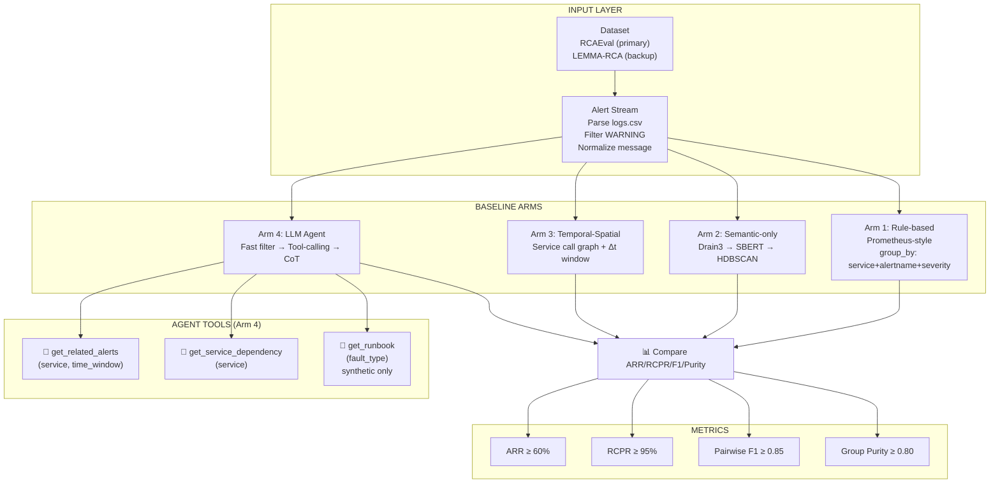

# Alert Aggregation from Early-Warning Logs in Microservices

**Research project** — 8-week timeline, supervised by Prof. Long

---

## 🎯 Research Objective

Investigate whether an **LLM agent with tool-calling** (combining semantic similarity + service topology + synthetic runbook reasoning) can reduce noisy early-warning alerts more effectively than rule-based, semantic-only, and temporal-spatial baselines — **while preserving root-cause signals (RCPR ≥ 95%)**.

| Dimension | Detail |
|-----------|--------|
| **Focus** | Early-warning / `WARNING` level logs (pre-failure) |
| **Architecture** | Microservices (Online Boutique, Sock Shop, Train Ticket) |
| **Primary Dataset** | RCAEval (`phamquiluan/RCAEval`) — 735 cases, MIT license |
| **Backup Dataset** | LEMMA-RCA (CC-BY-NC-4.0) — *does not solve WARNING gap* |
| **Timeline** | 8 weeks, ~2h/day |
| **Core Metrics** | ARR ≥ 60%, RCPR ≥ 95%, Pairwise F1 ≥ 0.85, Group Purity ≥ 0.80 |

---

## 🧭 Agent Topology & Navigation Graph



---

## 📁 Repository Structure

```
F:\study\NCKH\
├── README.md                    ← this file
├── PROJECT_MINDMAP.md           ← visual overview (some numbers outdated)
├── academicWords.md             ← academic terminology reference
├── IEEE_template/               ← LaTeX template for paper
├── PDF_NCKH/                    ← reference chapters (VN)
├── Resource/
│   ├── README                   ← original 8-week plan (VN)
│   ├── requirements.txt         ← Python dependencies
│   ├── PROJECT_MINDMAP.md       ← duplicate of root
│   ├── report/                  ← paper draft (LaTeX + docx)
│   │   ├── main.tex
│   │   ├── glossary.tex
│   │   ├── references.bib
│   │   └── *.docx
│   ├── cp1/                     ← Dataset Verification Workspace
│   │   ├── README.md            ← CP1 quickstart
│   │   ├── config/sources.yaml  ← HF dataset registry
│   │   ├── src/
│   │   │   ├── main_RCAEval.py  ← CLI: fetch/inspect/scan-warnings/timing/verify/all
│   │   │   ├── main_LEMMA_RCA.py
│   │   │   ├── main_LogHub2.py
│   │   │   ├── main_OpsEval.py
│   │   │   ├── main_CorrelatedAlerts.py
│   │   │   ├── main_Suricata_CTU13.py
│   │   │   └── cp1_core/        ← shared library
│   │   │       ├── analysis.py
│   │   │       ├── normalization.py
│   │   │       ├── severity.py
│   │   │       ├── dataset_io.py
│   │   │       ├── dataset_entrypoint.py
│   │   │       ├── fetchers.py
│   │   │       ├── paths.py
│   │   │       ├── reporting.py
│   │   │       └── source_registry.py
│   │   ├── docs/
│   │   │   ├── CP1_Ban_Dinh_Huong.md     ← 1-page direction for Prof. Long (VN)
│   │   ├── data_schema_notes.md  ← empirical verification on RCAEval
│   │   └── MIGRATION.md          ← old vs new CLI mapping
│   │   ├── tests/                ← pytest suite
│   │   ├── raw_data/             ← downloaded datasets (gitignored)
│   │   ├── external_repos/       ← cloned reference repos
│   │   ├── artifacts/            ← generated tables/reports
│   │   └── legacy/               ← deprecated scripts (kept for history)
│   └── cp2/
│       ├── CP2_Gap_Analysis.md   ← 1-page gap analysis for Prof. Long (VN)
│       └── _research_raw.md      ← raw literature notes (908 lines)
```

---

## ⚡ Quick Start (CP1 — Dataset Verification)

```powershell
# From repo root (F:\study\NCKH)
.\setup.ps1                          # creates .venv, installs deps

# RCAEval — primary dataset
.\.venv\Scripts\python cp1\src\main_RCAEval.py fetch
.\.venv\Scripts\python cp1\src\main_RCAEval.py inspect
.\.venv\Scripts\python cp1\src\main_RCAEval.py scan-warnings
.\.venv\Scripts\python cp1\src\main_RCAEval.py timing
.\.venv\Scripts\python cp1\src\main_RCAEval.py verify
.\.venv\Scripts\python cp1\src\main_RCAEval.py all              # runs full chain
```

---

## 📊 Key Empirical Findings (Verified on RCAEval)

| Item | Verified Value | Note |
|------|----------------|------|
| Total cases | 735 | 9 datasets × 3 systems |
| Cases **with logs** | **359** | RE1 (375 cases) = metric-only |
| Total log lines | 49,652,771 | scanned fully |
| Lines containing `WARN` | **9,738** (0.0196%) | Sock Shop 9,662 · Train Ticket 74 · Online Boutique 2 |
| Log columns | `timestamp`, `container_name`, `message` | **no `severity` column** |
| `root_cause.txt` cases | 8 | only 4 have `WARNING` as indicator |

**Critical constraint**: RCAEval **does not have a `severity` column**. Severity must be inferred via a 3-tier process (parse from message / frequency anomaly / root-cause label). See `Resource/cp1/docs/data_schema_notes.md` and `Resource/cp1/docs/CP1_Ban_Dinh_Huong.md §4.2`.

---

## 🔬 Four Experimental Arms

| Arm | Method | Tools / Tech | Expected Strength | Known Weakness |
|-----|--------|--------------|-------------------|----------------|
| **1. Rule-based** | Prometheus Alertmanager simulation | `group_by: service,alertname,severity` | Fast, deterministic | Topology-blind, manual rules |
| **2. Semantic-only** | Drain3 → Sentence-BERT → HDBSCAN | `all-MiniLM-L6-v2`, `sklearn` | No topology needed | **Drain3 drops severity**; causality-blind |
| **3. Temporal-Spatial** | Service call graph + sliding window | Topology from traces/repo, Δt ∈ {30,60,120}s | Catches cascading | Sensitive to τ/Δt; rigid |
| **4. LLM Agent** | Fast filter → Agent → ≤2 tool calls | `get_related_alerts`, `get_service_dependency`, `get_runbook` (synthetic) | Causal reasoning, flexible | Latency, token cost, non-deterministic |

**Agent constraint**: max **2 tool calls per grouping decision**.

---

## 📐 Metrics (Defined by This Work)

| Metric | Formula | Target | Note |
|--------|---------|--------|------|
| **ARR** | `1 − N_groups / N_raw_alerts` | ≥ 60% | Matches AlertGuardian definition |
| **RCPR** (service-level) | `𝟙(root_service ∈ primary_group) / M` | ≥ 95% | **Primary** — 359 cases |
| **RCPR** (alert-level) | `𝟙(root_alert ∈ primary_group)` | ≥ 95% | **Secondary** — only 4 cases |
| **Pairwise F1** | `2PR/(P+R)` on co-clustered pairs | ≥ 0.85 | Comparable to COLA (0.901–0.930) |
| **Group Purity** | `Σ max_count_per_group / N_total` | ≥ 0.80 | Prevents over-aggregation |

---

## 🧩 Research Gaps Addressed

| Gap | Why It Matters |
|-----|----------------|
| **No work on WARNING-level aggregation** | All prior work is post-failure (noise/critical binary) |
| **No root-cause preservation metric** | Prior metrics only measure compression (ARR) or pairwise correctness |
| **No hybrid topology + semantic + agent** | Arm 4 is the first to combine all three |
| **No public alert-level benchmark** | This work *creates* alert stream + labels from RCAEval — methodological contribution |

---

## 📅 8-Week Plan (Checkpoints)

| Week | Checkpoint | Deliverable | Review |
|------|------------|-------------|--------|
| **1** | CP1 | Dataset verified, 1-page direction | Self-check |
| **2** | CP2 | Gap analysis (1 page) | **Prof. Long** |
| **3** | CP3/4 | Parse RCAEval → `alerts.csv` | Self-check |
| **4** | CP4b/5 | MVP Agent + baseline + dependency table | Self-check |
| **5** | CP5 | Full run, ARR/RCPR/F1/Purity table | Self-check |
| **6** | CP6/7/8 | Draft → Final report | **Prof. Long** |

---

## 📄 Key Documents (Read in Order)

1. **`Resource/cp1/docs/CP1_Ban_Dinh_Huong.md`** — 1-page direction (VN), updated after empirical verification
2. **`Resource/cp2/CP2_Gap_Analysis.md`** — 1-page gap analysis (VN), FACT/INFERENCE/UNVERIFIED labeled
3. **`Resource/cp1/docs/data_schema_notes.md`** — Full empirical verification log (49.6M lines scanned)
4. **`Resource/PROJECT_MINDMAP.md`** — Visual overview (some numbers outdated, see banner)

---

## ⚠️ Threats to Validity (Declared Upfront)

1. **Severity is inferred**, not provided by dataset — 3-tier process documented in CP1 §4.2
2. **WARNING density skewed**: 99.2% from Sock Shop; Online Boutique ~0 lines
3. **Cascading at WARNING level**: nearly absent (Train Ticket 74 lines only)
4. **Runbooks are synthetic** — no production SOPs exist in RCAEval
5. **Service topology** built manually from public repos / traces (240 cases have `traces.parquet`)
6. **Ground truth at alert level**: only 4 cases — RCPR primary is service-level (359 cases)

---

## 🔗 References (Core)

- **COLA** — ICSE-SEIP 2024, arXiv:2403.06485 (pairwise F1 0.901–0.930, **not reproducible** on RCAEval — needs 3,000 SOPs)
- **AlertGuardian** — ASE 2025, arXiv:2601.14912 (ARR 94.8%, **dataset not public**, binary noise/critical)
- **RCAEval** — WWW 2025 Companion, arXiv:2412.17015 (735 cases, MIT, **no alert ground truth**)
- **LEMMA-RCA** — CIKM 2026, arXiv:2406.05375 (backup, **no WARNING in golden signals**)
- **Prometheus Alertmanager** — official docs (Arm 1 baseline)

---

## 🛠 Development Notes

- Python 3.10+ in `.venv`
- `pytest` for tests (`Resource/cp1/tests/`)
- Raw data in `Resource/cp1/raw_data/` (gitignored)
- Artifacts in `Resource/cp1/artifacts/`
- Legacy scripts in `Resource/cp1/legacy/` — **do not use for new work**

---

## 📝 License

Code: MIT (unless otherwise noted).
RCAEval data: MIT. LEMMA-RCA: CC-BY-NC-4.0 (non-commercial).
Derived datasets / synthetic runbooks: declare license at publication.